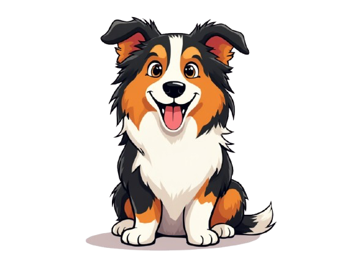
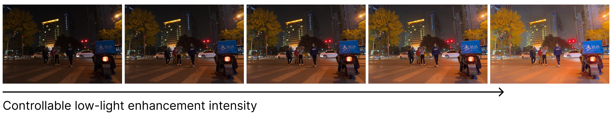
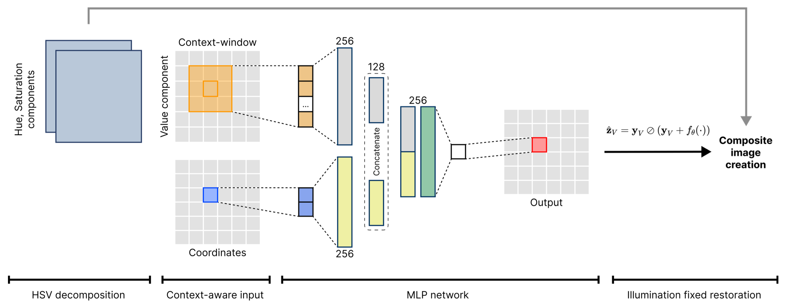
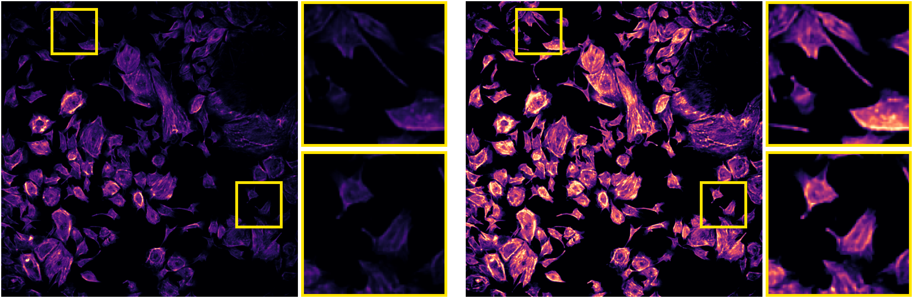

<h1 align="center"><strong>Fast Context-Based Low-Light Image Enhancement via Neural Implicit Representations [ECCV 2024]</strong></h1>

<p align="left">
  <p align="left">
    <a href='https://chobola.ai/' target='_blank'>Tomáš Chobola*</a>&emsp;
    <a href='' target='_blank'>Yu Liu</a>&emsp;
    <a href='https://scholar.google.de/citations?user=ZE_mde0AAAAJ&hl=cs&oi=sra' target='_blank'>Hanyi Zhang</a>&emsp;
    <a href='https://scholar.google.de/citations?user=FPykfZ0AAAAJ&hl=cs&oi=ao' target='_blank'>Julia A. Schnabel</a>&emsp;
    <a href='https://scholar.google.de/citations?user=jUiKc6QAAAAJ&hl=cs&oi=sra' target='_blank'>Tingying Peng</a>&emsp;
    <br>
    Technical University of Munich&emsp;Helmholtz AI&emsp;King’s College London
  </p>
</p>

[[`Paper`](https://arxiv.org/abs/2407.12511)] [[`Colab demo`](https://colab.research.google.com/github/ctom2/colie)] [[`BibTeX`](#citing-colie)]


🔥 Frame-by-frame enhancement of a low-light clip from Game of Thrones.

## Overview



<!---
Current deep learning-based low-light image enhancement methods often struggle with high-resolution images, and fail to meet the practical demands of visual perception across diverse and unseen scenarios. In this paper, we introduce a novel approach termed CoLIE, which redefines the enhancement process through mapping the 2D coordinates of an underexposed image to its illumination component, conditioned on local context. We propose a reconstruction of enhanced-light images within the HSV space utilizing an implicit neural function combined with an embedded guided filter, thereby significantly reducing computational overhead. Moreover, we introduce a single image-based training loss function to enhance the model’s adaptability to various scenes, further enhancing its practical applicability. Through rigorous evaluations, we analyze the properties of our proposed framework, demonstrating its superiority in both image quality and scene adaptability. Furthermore, our evaluation extends to applications in downstream tasks within low- light scenarios, underscoring the practical utility of CoLIE. 
-->

- **Challenges with Current Methods:** Existing deep learning methods for low-light image enhancement struggle with high-resolution images, and they often fail to meet practical visual perception needs in diverse, unseen scenarios.
- **Introduction of CoLIE:** CoLIE is a novel approach for enhancing low-light images. It works by mapping 2D coordinates of underexposed images to their illumination components, conditioned on local context.
- **Methodology:** The method utilizes HSV color space for image reconstruction. It employs an implicit neural function along with an embedded guided filter to further reduce computational overhead.
- **Innovations in Training:** CoLIE introduces a single image-based training loss function. This function aims to improve the model's adaptability across various scenes, enhancing its practical applicability.

## Neural Implicit Representation for Low-Light Enhancement



Our proposed framework begins with the extraction of the Value component from the HSV image representation. Subsequently, we employ a neural implicit representation (NIR) model to infer the illumination component which is an essential part for effective enhancement of the input low-light image. This refined Value component is then reintegrated with the original Hue and Saturation components, forming a comprehensive representation of the enhanced image. The architecture of CoLIE involves dividing the inputs into two distinct parts: the elements of the Value component and the coordinates of the image. Each of these components is subject for regularization with unique parameters within their respective branches. By adopting this structured approach, our framework ensures precise control over the enhancement process.

## Code

### Requirements

* python3.10
* pytorch==2.3.1

### Running the code

```
python colie.py
```

The code execution is controlled with the following parameters:
* `--input_folder` defines the name of the folder with input images
* `--output_folder` defines the name of the folder where the output images will be saved
* `--down_size` is the size to which the input image will be downsampled before processing
* `--epochs` defines the number of optimisation steps
* `--window` defines the size of the context window
* `--L` is the "optimally-intense threshold", lower values produce brighter images

The strength of the regularisation terms in the loss functon is defined by the following parameters: 
* `--alpha`: fidelity control (default setting: `1`)
* `--beta`: illumination smoothness (default setting: `20`)
* `--gamma`: exposure control (default setting: `8`)
* `--delta`: sparsity level (default setting: `5`)


<!---
## Comparison With the State-Of-The-Art for Low-Light Image Enhancement


-->


## Fluorescence Microscopy Intensity Correction



## Citing CoLIE

Please consider citing our paper if our code are useful:

```bibtex
@article{chobola2024fast,
      title={Fast Context-Based Low-Light Image Enhancement via Neural Implicit Representations}, 
      author={Tomáš Chobola and Yu Liu and Hanyi Zhang and Julia A. Schnabel and Tingying Peng},
      year={2024},
      eprint={2407.12511},
      archivePrefix={arXiv},
      primaryClass={cs.CV},
      url={https://arxiv.org/abs/2407.12511}, 
}
```
