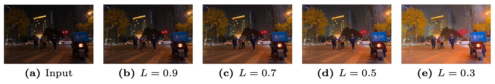
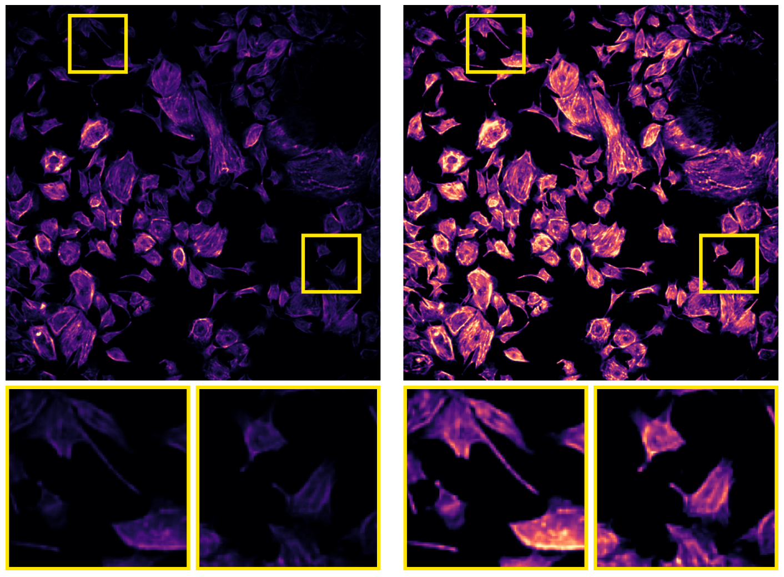

# Fast Context-Based Low-Light Image Enhancement via Neural Implicit Representations, ECCV 2024

\[[Paper](https://arxiv.org/abs/2407.12511)\]



Current deep learning-based low-light image enhancement methods often struggle with high-resolution images, and fail to meet the practical demands of visual perception across diverse and unseen scenarios. In this paper, we introduce a novel approach termed CoLIE, which redefines the enhancement process through mapping the 2D coordinates of an underexposed image to its illumination component, conditioned on local context. We propose a reconstruction of enhanced-light images within the HSV space utilizing an implicit neural function combined with an embedded guided filter, thereby significantly reducing computational overhead. Moreover, we introduce a single image-based training loss function to enhance the model’s adaptability to various scenes, further enhancing its practical applicability. Through rigorous evaluations, we analyze the properties of our proposed framework, demonstrating its superiority in both image quality and scene adaptability. Furthermore, our evaluation extends to applications in downstream tasks within low- light scenarios, underscoring the practical utility of CoLIE. 

## Neural Implicit Representation for Low-Light Enhancement


Our proposed framework begins with the extraction of the Value component from the HSV image representation. Subsequently, we employ a neural implicit representation (NIR) model to infer the illumination component which is an essential part for effective enhancement of the input low-light image. This refined Value component is then reintegrated with the original Hue and Saturation components, forming a comprehensive representation of the enhanced image. The architecture of CoLIE involves dividing the inputs into two distinct parts: the elements of the Value component and the coordinates of the image. Each of these components is subject for regularization with unique parameters within their respective branches. By adopting this structured approach, our framework ensures precise control over the enhancement process.

## Code

### Requirements

* python3.10
* pytorch==2.3.1

### Running the code

TODO

## Comparison With the State-Of-The-Art for Low-Light Image Enhancement


## Fluorescence Microscopy Intensity Correction



## Citation

```
@misc{chobola2024fast,
      title={Fast Context-Based Low-Light Image Enhancement via Neural Implicit Representations}, 
      author={Tomáš Chobola and Yu Liu and Hanyi Zhang and Julia A. Schnabel and Tingying Peng},
      year={2024},
      eprint={2407.12511},
      archivePrefix={arXiv},
      primaryClass={cs.CV},
      url={https://arxiv.org/abs/2407.12511}, 
}
```
